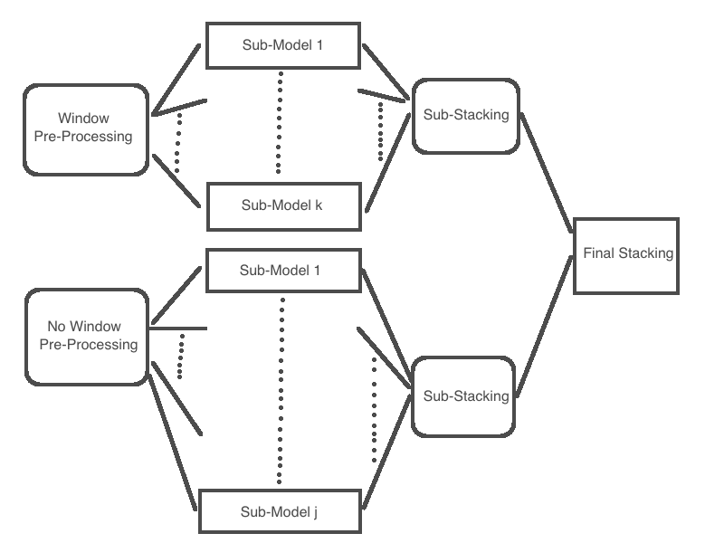

# Redefining Cancer Treatment

Project for Kaggle competition on spotting cancer by NLP. 
Features: Gene, Variation, Text description on the Variation. 
Target: 9 Class Label denoting the level of importance of the mutation. (Likely Neutral, Loss-of-function, Gain-of-function,..)

## Approach: 2 Layers stacking

Here is a representation of our Stacking approach:

### Window sub-stacking:
- Pre-Processing:
    - Creation of features: homogenezing variations, Text length, presence of variations and their abbreviation in the text, presence of genes.
    - Picking a window of sentences containing the variation or similar variation. Since the text is very noisy and long, this approach helps us capture central information about the variation.
    - Stopwords and custom stopwords to exclude. Testing with and without lemmatisation.
    - Retraining word2vec with 100,200,300 features and using Mean Embedding.
    - External pre-trained word2vec on biological documents.
    - TFIDF + 100,200,300 PCA reduction

- Modelling:
    - Cross-validation with XGboost to pick best configuration (100,200 or 300)
    - Grid-Searching hyper-parameters for XGboost, LightGBM, Logistic Regression, AdaBoostClassifier, Random Forest
    - Predicting the train set by cross-validation and the test set by averaging cross-validation predictions, for the final stacking.
    
### No-Window sub-stacking:
Ideas are the same as the window part, except we are not reducing our text upstream.

### Final Stacking:
Using our predictions from our 2 sub-stacking models, we build a Multinomial Logistic Regression upon it.

    

